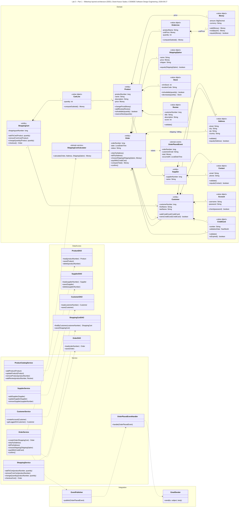
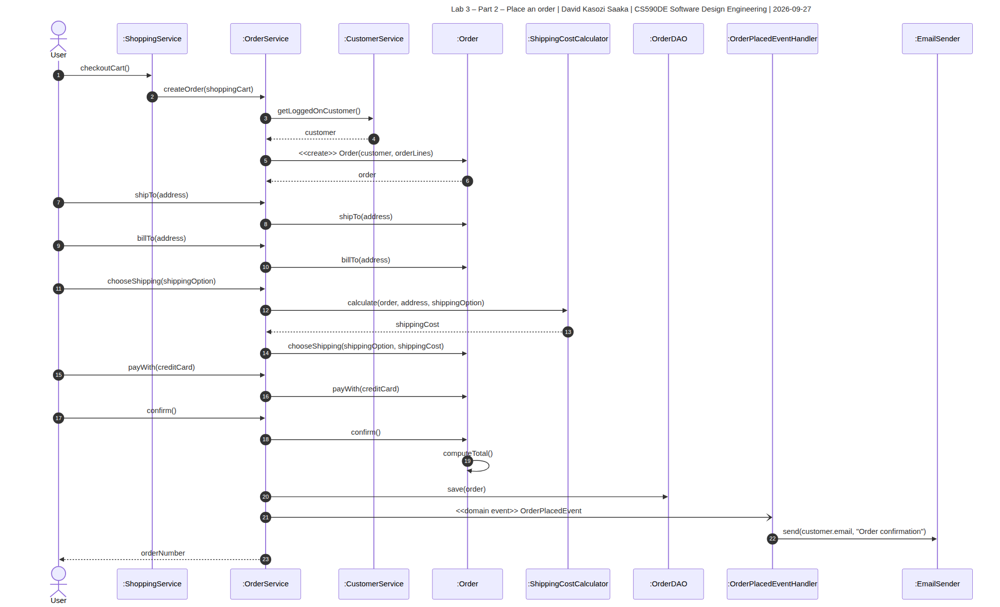

# Lab 3 – Domain Driven Design: Webshop

| | |
|---|---|
| **Student** | David Kasozi Saaka (<davidkasozisaaka@gmail.com>) |
| **Course** | CS590DE Software Design Engineering – 2026-08A-12B-01 |
| **Lab** | 3 – Domain Driven Design |
| **Lecture** | Lesson 3 – Domain Driven Design |
| **UML tool** | draw.io / diagrams.net (free, no expiry – same tool for the midterm) |
| **Submitted** | 2026-09-27 |

## What to hand in (per the assignment)

| # | Required | File |
|---|----------|------|
| 1 | Screenshot of Part 1 – class diagram with layers, classes, attributes, methods, relationships, and each domain class marked as entity / value object / domain service / domain event | [`diagrams/class-diagram.png`](diagrams/class-diagram.png) |
| 2 | Screenshot of Part 2 – sequence diagram for placing an order | [`diagrams/sequence-diagram.png`](diagrams/sequence-diagram.png) |

---

## Part 1 – Architecture and class diagram

### Layers

Four layers, following Lesson 3 (slides 2, 22, 64):

| Layer | Responsibility | Classes |
|---|---|---|
| **Service** | Reception desk. **No business logic.** Loads from a DAO, calls the domain, saves, talks to plumbing. | ProductCatalogService, SupplierService, CustomerService, ShoppingService, OrderService, OrderPlacedEventHandler |
| **Domain** | **All business logic.** Entities, value objects, domain service, domain event. | see below |
| **Data access** | Load and save only. | ProductDAO, SupplierDAO, CustomerDAO, ShoppingCartDAO, OrderDAO |
| **Integration** | Plumbing to the outside world. | EventPublisher, EmailSender |

Slide 64 draws the line the assignment is really testing:

- A **service-layer class** contains *no* business logic and only talks to plumbing.
- A **domain service** contains *only* business logic and never touches plumbing.

### Domain classes and their DDD classification

**Entities** — own identity, mutable, have a lifecycle (slides 35–37).

| Class | Identity | Why an entity |
|---|---|---|
| Product | productNumber | Price, stock and reviews change; identity stays. |
| Supplier | supplierNumber | The requirement says the administrator can *add, remove and **update*** suppliers — mutable with a lifecycle. Two suppliers with the same name and phone are still different suppliers. It also has its own `SupplierDAO`; value objects are persisted inside the entity that owns them, not through their own DAO. |
| Customer | customerNumber | Same customer when the address or cards change. |
| ShoppingCart | shoppingcartNumber | Lines are added and removed over time. |
| Order | orderNumber | Lifecycle: created → shipTo → billTo → payWith → confirmed (slide 35). |

**Value objects** — no identity, attribute equality, immutable, self-validating (slides 39–49).
Following "always prefer value objects over entities" (slide 55) and "small entity class with many
value classes" (slide 56).

| Class | Belongs to | Why a value object |
|---|---|---|
| Money | Product.price, OrderLine.unitPrice, ShippingOption.price, Order total | The lecture's flagship example (slides 46–49): immutable, combinable via `add`/`multiply`, validated in the constructor. |
| Address | Customer, Supplier, Order (shipping + billing) | Two addresses with the same street/city/zip are the same address. Replaced, never edited. |
| Contact | Customer, Supplier | Slide 54 exactly — email + phone pushed out of a fat `Customer` into a cohesive value object. |
| Account | Customer | "Customers can create an account so they can login." Username + password, with `check(password)`. |
| CreditCard | Customer, Order | Two cards with the same number and expiry are the same card. |
| ShippingOption | Order | Name, price and shipper — fully defined by its values. |
| Stock | Product | numberInStock + warehouse location code are cohesive; `decrease()` returns a new Stock. |
| Review | Product | Straight from slide 42. Carries `customerNumber` so we know who wrote it. |
| CartLine | ShoppingCart | Product + quantity. Changing the quantity replaces the line. |
| OrderLine | Order | Freezes `productName` and `unitPrice` at order time — if the product's price changes later, past orders must not change. |

**Domain service** — behaviour belonging to no single entity or value object (slides 58–63).

| Class | Why a domain service |
|---|---|
| ShippingCostCalculator | Shipping cost depends on the **Order** (lines/weight), the **Address** (region) and the **ShippingOption** together. Putting the rules on `Order` would make it know about regional pricing; putting them on `Address` makes no sense. Stateless, defined in terms of other domain objects, never touches plumbing. |

**Domain event** — something important that already happened, immutable (slides 66–68).

| Class | Raised when | Handled by |
|---|---|---|
| OrderPlacedEvent | `Order.confirm()` succeeds | `OrderPlacedEventHandler` → `EmailSender`. This is how *"when an order is placed, the webshop should send an email"* is satisfied without `OrderService` depending on email plumbing — choreography rather than orchestration (slides 28–31). |

### Rich vs. anemic — where the business logic lives

The naming is deliberate. `setShippingAddress()` is a data operation; `shipTo()` is a business
operation. Slides 19–26 mark the difference between an anemic and a rich domain model.

| Requirement | Anemic (avoid) | Rich (this design) |
|---|---|---|
| Add multiple copies of a product to the cart | Service loops and increments | `ShoppingCart.addToCart(product, qty)` merges into the existing `CartLine` |
| Place an order from the cart | Service builds the Order by hand | `ShoppingCart.checkout()` returns an Order |
| Order total | Service sums line prices | `Order.computeTotal()` using `Money.add()` |
| Stock check | Service compares two ints | `Product.isAvailable(qty)` → `Stock.decrease(qty)` |
| Set the shipping address | `order.setShippingAddress(a)` | `order.shipTo(a)` — validates and means something |
| Pay | Service checks the payment type | `Order.payWith(creditCard)`; no other payment type exists in the model |

---

## Part 2 – Sequence diagram: placing an order

Checkout is a wizard, not one atomic call — the customer moves through several pages, so the
`Order` is built up across a number of interactions and only becomes final at `confirm()`.

1. `checkoutCart()` → `OrderService.createOrder(shoppingCart)`.
2. The service asks `CustomerService` who is logged on, then creates the `Order` with its
   `OrderLine`s taken from the cart.
3. The customer supplies the shipping address, billing address, shipping option and credit
   card. Each one is a domain operation on `Order` — `shipTo`, `billTo`, `chooseShipping`,
   `payWith` — not a setter.
4. Choosing a shipping option calls the domain service `ShippingCostCalculator`.
5. `confirm()` computes the total and the order is saved through `OrderDAO`.
6. An `OrderPlacedEvent` is raised (async arrow). `OrderPlacedEventHandler` receives it and
   asks `EmailSender` to send the confirmation — the order flow does not wait on email.

---

## Rendering the diagrams

Both `.mmd` sources are in `diagrams/`. To produce the hand-in screenshots:

1. Open [draw.io](https://app.diagrams.net) → **Arrange → Insert → Advanced → Mermaid**.
2. Paste the contents of `diagrams/class-diagram.mmd`, insert, arrange the four layers as
   vertical swimlanes, then **File → Export as → PNG**.
3. Repeat for `diagrams/sequence-diagram.mmd`.

---

My notes on the lecture this lab is based on: [`docs/lessons/lesson-03-domain-driven-design.md`](../../docs/lessons/lesson-03-domain-driven-design.md)
